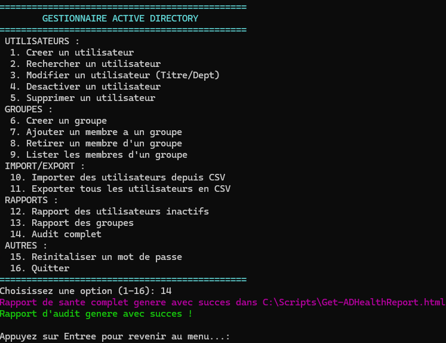
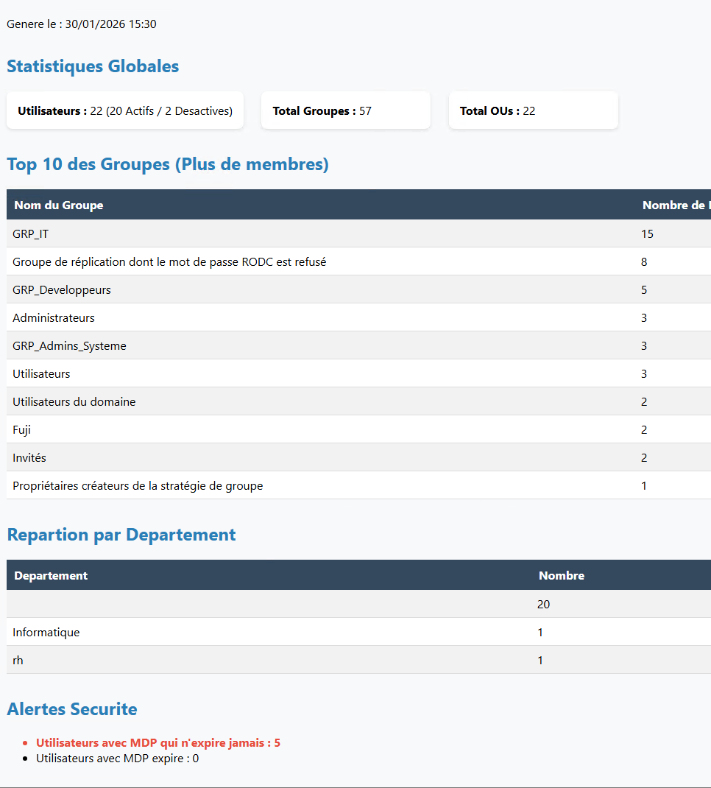

Atelier PowerShell & Active Directory

#DETAILS

#         PARTIE 1
# 1.1 - Installation du module (si nécessaire)
# Vérifiez si le module ActiveDirectory est disponible sur votre système. Si ce n'est pas le cas, installez-le.
     Get-Module -ListAvailable ActiveDirectory                                                                # Vérifier si le Pc à le module
     Add-WindowsCapability -Online -Name Rsat.ActiveDirectory.DS-LDS.Tools~~~~0.0.1.0                         # Commande pour installer le module si nécessaire.

  # 1.2 - Exploration du module

# Listez toutes les cmdlets disponibles dans le module ActiveDirectory    
    Get-Command -Module ActiveDirectory          
# Combien de cmdlets sont disponibles ?  **151**
    Get-Command -Module ActiveDirectory | Measure-Object

# Listez uniquement les cmdlets qui commencent par Get-ADUser
    Get-Command -Module ActiveDirectory -Name Get-ADUser*
-----------     ----                                               -------    ------
Cmdlet          Get-ADUser                                         1.0.1.0    ActiveDirectory
Cmdlet          Get-ADUserResultantPasswordPolicy                  1.0.1.0    ActiveDirectory

# Affichez l'aide complète de la cmdlet Get-ADUser
    Get-Help Get-ADUser -Full

# 1.3 - Connexion à l'Active Directory
# Testez votre connexion à l'AD en récupérant des informations sur le domaine    
    Get-ADDomain
# Affichez le nom du domaine, le niveau fonctionnel et les contrôleurs de domaine
    Get-ADDomain | Select-Object DNSRoot, DomainMode

     DNSRoot              DomainMode
     -------              ----------
   formation.lan           Windows2025Domain

# 1.4 - Premier utilisateur

# Récupérez les informations de votre propre compte utilisateur AD     
# Affichez toutes ses propriétés
    Get-ADUser -Identity "Administrateur" -Properties *

# Affichez uniquement son nom, son email et son titre
    Get-ADUser -Identity "Administrateur" -Properties EmailAddress, Title | Select-Object Name, EmailAddress, Title

    ------------------------------------------------------------------------------------------------

#        PARTIE 2 
# GESTION DES UTILISATEURS

# 2.1 - Créer des utilisateurs
# Créez les utilisateurs suivants dans l'OU de votre choix :

Prénom  	Nom	    Login	     Email	                           Titre
Alice    	Martin	 amartin	alice.martin@techsecure.fr  	 Développeuse
Bob     	Dubois   bdubois    bob.dubois@techsecure.fr	     Administrateur Système
Claire	    Bernard	 cbernard	claire.bernard@techsecure.fr	 Chef de Projet

# Création du OU (TechSecure)
    New-ADOrganizationalUnit -Name "TechSecure" -Path "DC=formation,DC=lan"
# Création du OU (Users)
    New-ADOrganizationalUnit -Name "Users" -Path "OU=TechSecure,DC=formation,DC=lan"

# Création des utilisateurs    (Définir un mot de passe initial (ex: "P@ssw0rd123!", Le compte doit être activé, Le mot de passe doit être changé à la première connexion)

.png>)

# 2.2 Rechercher des utilisateurs
# Lister tous les utilisateur de votre domaine
    Get-ADUser -Filter *

# Trouver l'utilisateur dont le login est "amartin"
    Get-ADUser -Identity "amartin"

# Trouver les utilisateurs dont le nom commence par un "B"
    Get-ADUser -Filter 'Surname -like "B*"' | Select-Object Name, SamAccountName

# Trouvez tous les utilisateurs qui ont "Administrateur" dans leur titre
    Get-ADUser -Filter 'Title -like "*Administrateur*"' -Properties Title | Select-Object Name, Title

# Comptez le nombre total d'utilisateurs dans votre domaine
    (Get-ADUser -Filter *).Count

# 2.3 Modifier des utilisateurs    
# Pour l'utilisateur "amartin" :
Changez son numéro de téléphone (ajoutez: "01 23 45 67 89")
Ajoutez une description ("Membre de l'équipe développement")
Changez son titre en "Développeuse Senior"

    Set-ADUser -Identity "amartin" `
           -OfficePhone "01 23 45 67 89" `
           -Description "Membre de l'équipe développement" `
           -Title "Développeuse Senior"
# Vérification
    Get-ADUser -Identity "amartin" -Properties OfficePhone, Description, Title | Select-Object Name, OfficePhone, Description, Title

# Désactiver et supprimer
# Désactivez le compte "bdubois"
    Disable-ADAccount -Identity "bdubois"
# Vérifiez qu'il est bien désactivé
    Get-ADUser -Identity "bdubois" | Select-Object Name, Enabled
Le terminal affiche False dans la colonne Enabled, le compte est bien désactivé.
# Supprimez le compte "cbernard" (attention : demander confirmation avant)
    Remove-ADUser -Identity "cbernard" -Confirm:$true

#       PARTIE 3
#     GESTION DES GROUPES

Créez les groupes de sécurité suivants :

Nom du groupe	      Type	           Portée	                    Description
GRP_Developpeurs	Security	        Global                     	Équipe de développement
GRP_Admins_Systeme	Security	        Global                     	Administrateurs système
GRP_Chefs_Projet	Security	        Global                     	Chefs de projet
GRP_IT             	Security	        Global	                    Ensemble du département IT

# On crée l'OU Groups à l'intérieur de TechSecure
    New-ADOrganizationalUnit -Name "Groups" -Path "OU=TechSecure,DC=formation,DC=lan"

-1.png>)

# - Ajouter des membres

# Ajoutez "amartin" dans le groupe "GRP_Developpeurs"
    Add-ADGroupMember -Identity "GRP_Developpeurs" -Members "amartin"
# Ajoutez "bdubois" dans le groupe "GRP_Admins_Systeme"
    Add-ADGroupMember -Identity "GRP_Admins_Systeme" -Members "bdubois"
# Créez 2 nouveaux utilisateurs et ajoutez-les dans "GRP_Developpeurs"
.png>)
   
# Ajoutez tous les membres des trois premiers groupes dans "GRP_IT"
    Add-ADGroupMember -Identity "GRP_IT" -Members "GRP_Developpeurs", "GRP_Admins_Systeme", "GRP_Chefs_Projet"
# Lister les appartenances

# Affichez tous les membres du groupe "GRP_IT"
    Get-ADGroupMember -Identity "GRP_IT" | Select-Object Name, objectClass
# Affichez tous les groupes dont "amartin" est membre
    Get-ADPrincipalGroupMembership -Identity "amartin" | Select-Object Name
# Comptez combien de membres a chaque groupe
-1.png>)

# Retirer des membres
# Retirez "amartin" du groupe "GRP_IT"
    Remove-ADGroupMember -Identity "GRP_IT" -Members "amartin" -Confirm:$false
# Vérifiez qu'elle n'en est plus membre
    Get-ADGroupMember -Identity "GRP_IT" | Select-Object Name, SamAccountName

# 3.5 - Groupes imbriqués

# Créez un groupe "GRP_Tous_Utilisateurs"
.png>)
# Ajoutez-y les groupes "GRP_IT" (pas les membres individuels, mais le groupe lui-même)
    Add-ADGroupMember -Identity "GRP_Tous_Utilisateurs" -Members "GRP_IT"
# Listez les membres (directs et récursifs) de "GRP_Tous_Utilisateurs"
-1.png>)

#  Partie 4 : Organisation avec les Unités Organisationnelles (OU)
# Créer une structure d'OU

# Créez la structure suivante dans votre domaine :

TechSecure/
├── Utilisateurs/
│   ├── Informatique/
│   │   ├── Developpement/
│   │   └── Infrastructure/
│   ├── RH/
│   └── Commercial/
├── Groupes/
└── Ordinateurs/

.png>)

# Déplacer des objets

# Déplacez l'utilisateur "amartin" dans l'OU "TechSecure/Utilisateurs/Informatique/Developpement"
    $targetOU = "OU=Developpement,OU=Informatique,OU=Utilisateurs,OU=TechSecure,DC=formation,DC=lan"
    Get-ADUser -Identity "amartin" | Move-ADObject -TargetPath $targetOU
# Déplacez tous vos groupes créés précédemment dans l'OU "TechSecure/Groupes"
    $targetGroupsOU = "OU=Groupes,OU=TechSecure,DC=formation,DC=lan"
    Get-ADGroup -Filter 'Name -like "GRP_*"' | Move-ADObject -TargetPath $targetGroupsOU
# Listez tous les utilisateurs présents dans l'OU "Informatique" (incluant les sous-OU)
    $infoOU = "OU=Informatique,OU=Utilisateurs,OU=TechSecure,DC=formation,DC=lan"
    Get-ADUser -Filter * -SearchBase $infoOU -SearchScope Subtree | Select-Object Name, DistinguishedName

# Recherche par OU
# Comptez le nombre d'utilisateurs dans l'OU "Informatique" uniquement (sans les sous-OU)
    (Get-ADUser -Filter * -SearchBase $infoOU -SearchScope OneLevel).Count
# Comptez le nombre d'utilisateurs dans l'OU "Informatique" en incluant tous les sous-niveaux
    (Get-ADUser -Filter * -SearchBase $infoOU -SearchScope Subtree).Count

#   PARTIE 5
#  Import en masse depuis CSV
# Préparer le fichier csv
Créez un fichier nouveaux_employes.csv avec 13 employés fictifs (Prenom,Nom,Login,Titre,Departement,OU)
Créez un script Import-ADUsersFromCSV.ps1
Améliorer le script avec gestion d'erreurs
Modifiez votre script pour :

Vérifier que le CSV existe avant de commencer
Utiliser try-catch pour gérer les erreurs de création
Vérifier si l'utilisateur existe déjà avant de le créer
Logger les succès et les erreurs dans un fichier import.log
Afficher un résumé à la fin (X créés, Y erreurs)
Ajoutez une colonne "Groupes" dans votre CSV (plusieurs groupes séparés par des points-virgules).

Modifiez votre script pour ajouter automatiquement les utilisateurs dans les groupes spécifiés.

#   PARTIE 6
# Scripts d'automatisation
# Créez un script New-Employee.ps1 qui prend des paramètres et effectue un onboarding complet :
# Script d'offboarding Créez un script Remove-Employee.ps1 
# Script de modification de mot de passe Créez un script Reset-EmployeePassword.ps1

#   PARTIE 7 & 8: Rapports et audits & Outil de gestion AD complet

.png>)

